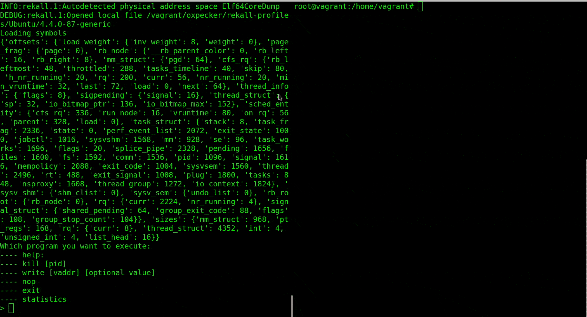

# Oxpecker

Writable Virtual Machine Introspection API.

This is a framework which one can use it for writing without concern of inconsistency or concurrency in read/write APIs.  
# Requirements

- `kvm-vmi`
- `python 3`
- `docopt`
- `libvirt`
- `ioctl-opt Python 3`
- `cffi Python3` (optional)
- `libvmi` (optional)
- `rekall` (optional)

# Setup

- Setup a KVM-VMI
- Copy this folder to hypervisor

# Usage

- Run `./main.py <VM-NAME>`

# Killing Process
We already write a tools to kill process from hypervisor. 

#